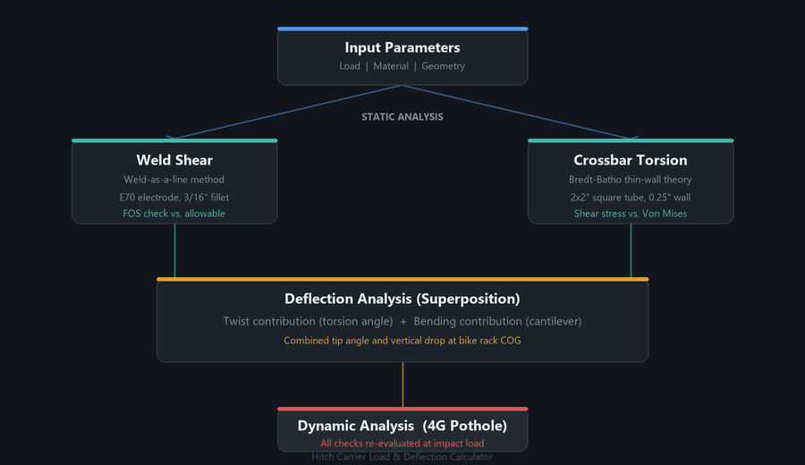

# Hitch Carrier Load & Deflection Calculator

MATLAB script for analytically verifying a custom-fabricated vehicle hitch carrier. Built during the design of a bike-carrying hitch rack to check weld integrity, structural deflection, and dynamic load resistance before fabrication.

Full project writeup: [aaronevans.ca/hitch](https://aaronevans.ca/hitch/)

## Analysis Overview

The calculator runs four checks against a 180 lb payload at the bike rack center of gravity:

| Check | Method |
|-------|--------|
| **Weld shear** | Weld-as-a-line, E70 electrode allowable stress |
| **Crossbar torsion** | Bredt-Batho thin-wall shear (2x2" square tube) |
| **Receiver deflection** | Superposition of cantilever bending + torsional twist |
| **Dynamic loads** | All checks re-run at 4G (pothole impact factor) |

Deflection is calculated at both the receiver tip and the bike rack COG by projecting through the combined tip angle (bending slope + twist).

## Key Assumptions

- A36 steel, E = 29 Msi, yield = 46 ksi
- 3/16" fillet welds, E70 series electrodes
- Von Mises shear criterion for torsion checks
- Receiver modeled as a cantilever from the hitch pin
- Torsional load split 50/50 between left and right crossbar arms
- 4G dynamic multiplier for pothole simulation

## Geometry

- **Crossbar:** 2" x 2" x 0.25" wall, 38" long
- **Receiver:** 2.63" x 2.63" x 0.25" wall
- **Moment arm:** 29" horizontal + 36" vertical from hitch pin to COG

## Usage

Open `hitch_calculator.m` in MATLAB and run. Outputs a formatted table of factors of safety and deflection values for both static and dynamic loading.

## Author

Aaron Evans -- Mechanical Engineering, University of Victoria
